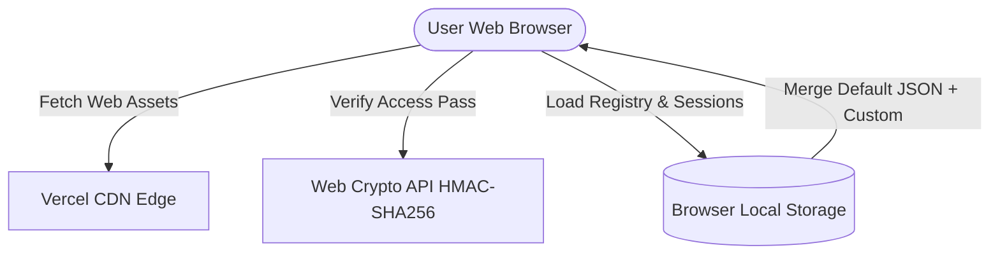
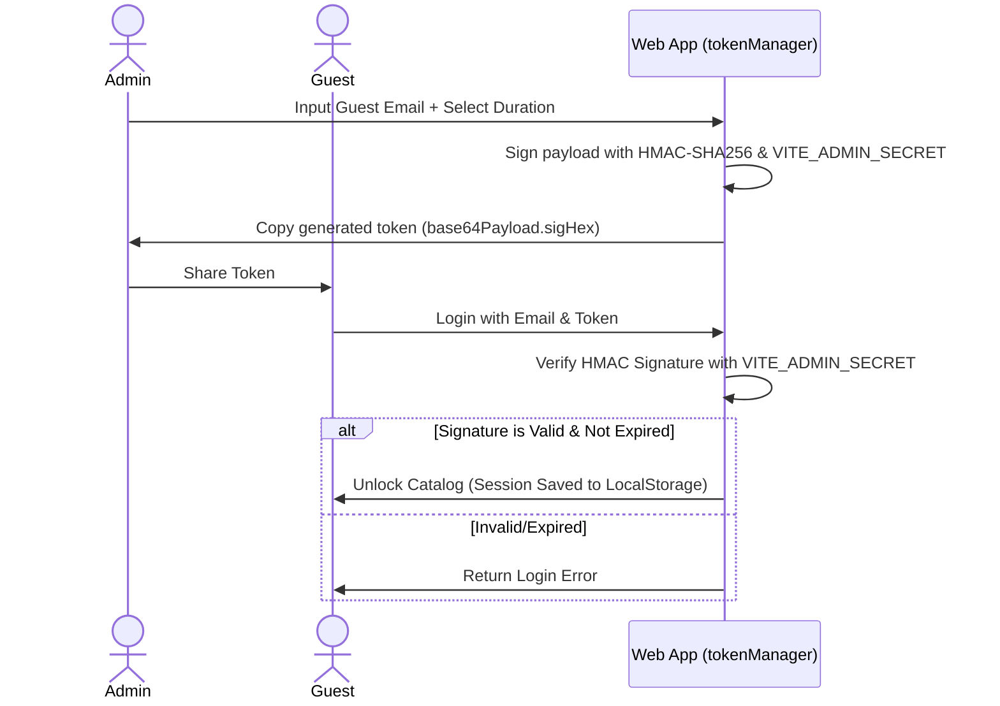

# Architecture Document: Private AI Agents Portal

This document outlines the system architecture, component breakdown, and client-side data schema for the modernized, stateless Private AI Agents Portal.

---

## 1. System Overview

The Private AI Agents Portal is a database-free, zero-configuration static web application. It eliminates external databases (Firestore) and identity providers (Google OAuth), relying instead on **client-side cryptographic signature verification** via the browser's native **Web Crypto API**.

---

## 2. Monorepo Repository Structure

The repository workspace structure:
* **`/apps/web`:** React, TypeScript, and Vite single-page frontend.
  * **`src/components`:** UI widgets (Navbar, etc.).
  * **`src/context`:** Authentication session and roles context provider (`AuthContext`).
  * **`src/data`:** Pre-seeded directory items (`default-agents.json`).
  * **`src/pages`:** Directory Catalog (`Dashboard`), cryptographic pass manager (`Admin`), and credential forms (`Login`).
  * **`src/utils`:** HMAC-SHA256 token encoding, signature, and validation methods (`tokenManager`).
* **`/docs`:** Manuals, recovery runbooks, and operator guides.

---

## 3. Technology Stack

* **Frontend Framework:** React 18, TypeScript, Vite
* **Styling & Theme:** Tailwind CSS, CSS-only lag-free hover tooltips, dark mode variables
* **Crypto Engine:** Native browser `window.crypto.subtle` (no heavy third-party npm packages)
* **Hosting Platform:** Vercel (Edge-cached CDN with client-side SPAs redirect rules)

---

## 4. Client State & Storage Schema (LocalStorage)

Because there is no external database, all user-specific overrides, custom items, and admin configurations are stored in browser `localStorage`:

### `access_pass_token` (String)
* Holds the cryptographically signed JWT-like token string (`base64Payload.signatureHex`).

### `access_pass_email` (String)
* Holds the email address linked to the active session.

### `custom_agents` (JSON Array)
* Stores user-created CustomGPT entities.
* Structure:
  * `id`: Unique string ID (e.g. `custom_1700000000000`)
  * `name`: String
  * `url`: String (ChatGPT URL)
  * `description`: String
  * `categoryId`: String (`plan` | `do` | `check` | `act`)
  * `createdBy`: String (Creator email)
  * `createdAt`: ISO Date String
  * `updatedAt`: ISO Date String

### `deleted_agents` (JSON Array of Strings)
* Blacklist of default agent IDs that the user has deleted from their local registry layout.

### `issued_passes` (JSON Array - Admins Only)
* Registry of cryptographic access pass tokens generated by the administrator.
* Structure:
  * `id`: String
  * `email`: String
  * `duration`: String (`1_month` | `3_months` | `1_year`)
  * `token`: String (cryptographic hash)
  * `createdAt`: ISO Date String
  * `expiresAt`: ISO Date String

### `local_audit_logs` (JSON Array - Admins Only)
* Stores local administrative action logs.
* Structure:
  * `id`: String
  * `timestamp`: ISO Date String
  * `action`: String (`generate_pass` | `revoke_pass`)
  * `details`: String

---

## 5. Cryptographic Token Lifecycle

Access passes are issued and validated entirely in the browser:

* **Master Backdoor Key:** The administrator uses `rajajeevankumar@gmail.com` and the exact value of the backend secret environment variable `VITE_ADMIN_SECRET` to bypass token generation and obtain full privileges.
