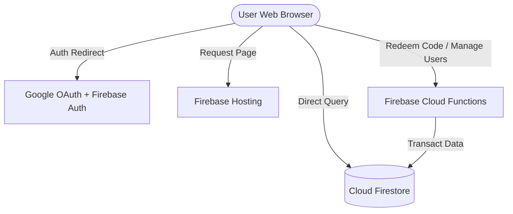

# Architecture Document: Private AI Agents Portal

This document outlines the system architecture, component breakdown, and tech stack for the modernized Private AI Agents Portal.

---

## 1. System Overview

The Private AI Agents Portal is a serverless SaaS portal designed to manage a curated directory of CustomGPTs and AI Agents. It replaces a client-side localStorage prototype with a Google Identity-secured serverless framework.

---

## 2. Monorepo Repository Structure

The project is structured as a workspace monorepo:
* `/apps/web`: React, TypeScript, and Vite single-page frontend.
* `/functions`: Serverless Node.js backend functions.
* `/infrastructure`: Declarative configurations for Firestore rules and indexes.
* `/scripts`: Management scripts for seeding and backing up.
* `/docs`: Manuals, recovery runbooks, and operator guides.

---

## 3. Technology Stack

* **Frontend Framework:** React 18, TypeScript, Vite
* **Styling & Theme:** Tailwind CSS, custom brand color variables (Light/Dark themes)
* **Backend:** Firebase Cloud Functions (Node.js 18)
* **Database:** Cloud Firestore (Document NoSQL)
* **Hosting:** Firebase Hosting (CDN cached edge routing)
* **Identity Provider:** Google Sign-in via Firebase Authentication
* **CI/CD:** GitHub Actions

---

## 4. Database Schema (Firestore)

### `users` (Collection)
* `id` (Document ID / User UID)
* `email` (String)
* `name` (String)
* `role` (String: `super_admin` | `admin` | `authorized_user`)
* `status` (String: `pending_approval` | `approved` | `suspended`)
* `createdAt` (Timestamp)
* `lastLogin` (Timestamp)

### `categories` (Collection)
* `id` (Document ID)
* `name` (String: `plan` | `do` | `check` | `act`)
* `sortOrder` (Number)

### `agents` (Collection)
* `id` (Document ID)
* `name` (String)
* `url` (String)
* `description` (String)
* `categoryId` (String)
* `createdBy` (String)
* `createdAt` (Timestamp)
* `updatedAt` (Timestamp)

### `access_codes` (Collection)
* `id` (Document ID)
* `code` (String)
* `issuedTo` (String)
* `createdBy` (String)
* `createdAt` (Timestamp)
* `expiresAt` (Timestamp)
* `used` (Boolean)
* `redeemedBy` (String)
* `redeemedEmail` (String)
* `redeemedAt` (Timestamp)

### `audit_logs` (Collection)
* `id` (Document ID)
* `userId` (String)
* `userEmail` (String)
* `action` (String: `redeem_code` | `generate_code` | `update_user` etc.)
* `entity` (String)
* `entityId` (String)
* `timestamp` (Timestamp)
* `details` (Map/Object)
