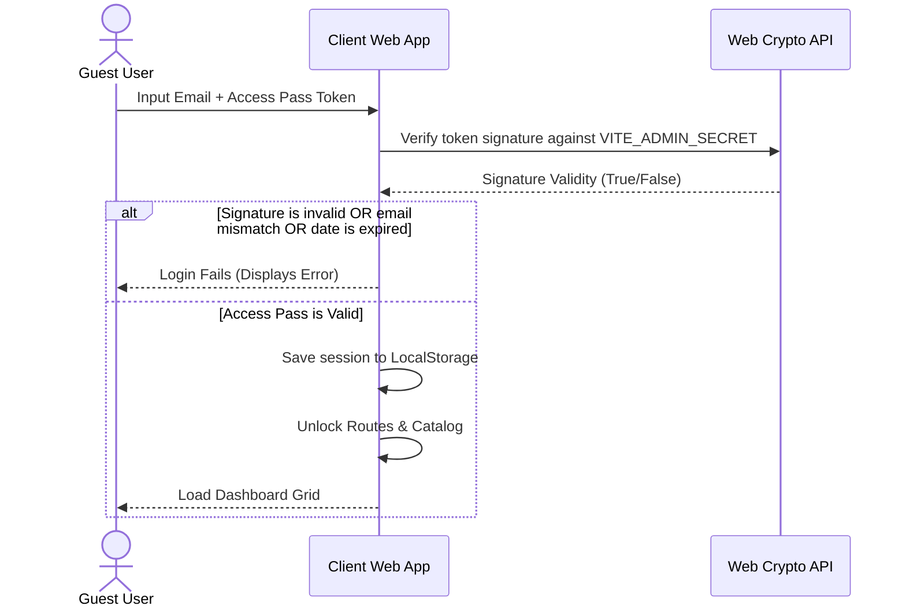

# Security Architecture: Private AI Agents Portal

This document outlines the authentication protocol, cryptographic verification, and security controls built into the Private AI Agents Portal.

---

## 1. Authentication & Security Topology

The portal runs as a stateless client application, removing server-side database targets. Security checks are executed in the client's browser sandbox using cryptographic signatures:



---

## 2. Cryptographic Access Pass Protocol

Access passes are cryptographically signed payloads following a JWT-inspired structure:
1. **Payload Structure:**
   ```json
   {
     "email": "guest@example.com",
     "expiresAt": 1781300000000,
     "role": "authorized_user"
   }
   ```
2. **Signature Method:**
   * The JSON payload is Base64 encoded: `base64Payload = btoa(JSON.stringify(payload))`.
   * An HMAC-SHA256 signature is calculated on the raw JSON payload using the environment variable `VITE_ADMIN_SECRET`:
     `sigHex = HMAC_SHA256_Hex(payload, secret)`.
   * The final token is formatted as: `base64Payload.sigHex`.
3. **Validation Checks:**
   * **Integrity Check:** The app recalculates the signature and verifies it matches `sigHex`.
   * **Email Match Check:** The logged-in email must match the token's embedded `email`.
   * **Expiration Check:** The current timestamp `Date.now()` must be less than `expiresAt`.

---

## 3. OWASP Top 10 Mitigation Matrix

| OWASP Top 10 Risk | Mitigation Strategy |
| :--- | :--- |
| **A01:2021-Broken Access Control** | Client route guards (`ApprovedRoute`, `AdminRoute`) enforce access limits. Suspended states and expiries block route loading. |
| **A02:2021-Cryptographic Failures** | TLS enforced by Vercel Hosting. Access pass signatures use cryptographically strong browser-native HMAC-SHA256. |
| **A03:2021-Injection** | Remove NoSQL/SQL databases. Input sanitization prevents scripting injection in custom agent imports. |
| **A04:2021-Insecure Design** | Separation of duties. Admin key is never stored in public JavaScript bundles (baked in via Vercel env at compile-time). |
| **A05:2021-Security Misconfiguration** | local environment variable config (`.env`) is excluded from Git to prevent secret key leaks. |
| **A08:2021-Software and Data Integrity** | Continuous builds compile client code through clean environment configurations. |
| **A09:2021-Security Logging** | Admin actions (pass generation/revocation) generate structured entries in local storage audit logs. |
