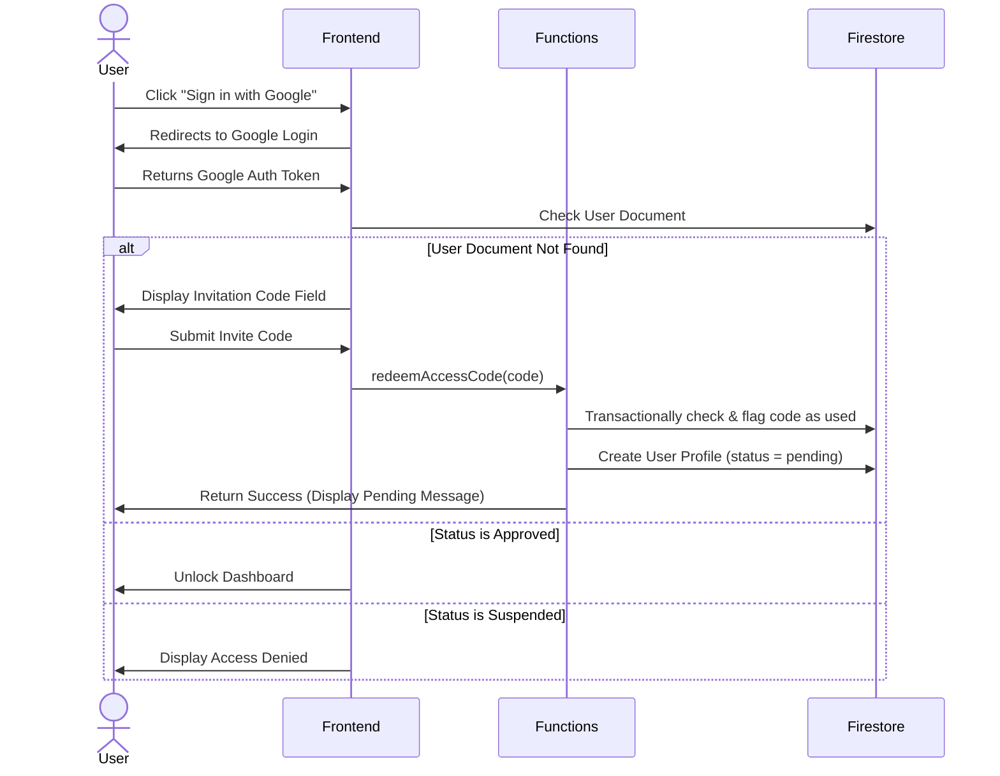

# Security Architecture: Private AI Agents Portal

This document details the security posture, Authentication/Authorization flows, and OWASP Top 10 mitigation strategies.

---

## 1. Authentication & Registration Flow

The system employs a multi-tiered security model to prevent unauthorized access:

1. **Google Identity Check:** Users must authenticate using a verified Google Account.
2. **Access Code Check:** Unregistered users are blocked and must redeem a one-time invitation code issued by an Admin.
3. **Admin Approval:** Redeeming the code places the account in a `pending_approval` state. An administrator must manually approve the user in the Admin Dashboard to grant access.
4. **Active Revocation:** Suspended accounts lose access immediately in real-time.

---

## 2. OWASP Top 10 Mitigation Matrix

| OWASP Top 10 Risk | Mitigation Strategy |
| :--- | :--- |
| **A01:2021-Broken Access Control** | Firestore Security Rules deny reads/writes unless user is marked `approved` in the database. Role modifications restricted to Super Admin. |
| **A02:2021-Cryptographic Failures** | TLS enforced by Google/Firebase Hosting. Sensitive auth tokens and cookies managed directly by Google Identity APIs. |
| **A03:2021-Injection** | Firestore parameterized queries prevent SQL/NoSQL Injection. Cloud Functions validate input data before executing writes. |
| **A04:2021-Insecure Design** | Principle of Least Privilege: Clients have zero write access to audit logs, access codes, and other user profiles. |
| **A05:2021-Security Misconfiguration** | Infrastructure configurations (`firebase.json`, `firestore.rules`) declared inside version control (IaC) and validated on CI/CD pipelines. |
| **A06:2021-Vulnerable Components** | Automated dependency checks. Code written without bloated direct dependencies on third-party backend packages. |
| **A07:2021-Identification & Authentication** | Delegated entirely to Google Identity Platforms. Access codes redeemed via Cloud Functions transaction checks. |
| **A08:2021-Software and Data Integrity** | Deployment pipelines run on GitHub Actions checking, linting, and compiling before committing builds to CDN hosting edges. |
| **A09:2021-Security Logging and Monitoring** | All write operations, approvals, suspensions, and registration code creations generate records in the `audit_logs` collection. |

---

## 3. Session Security & Headers

* **Content-Security-Policy (CSP):** Configured via Firebase Hosting headers to block unsafe inline scripts and enforce connections only to verified Firebase endpoints.
* **HTTP Headers:** Secure cookies, `SameSite=Strict`, `HttpOnly` and `Secure` markers managed by Google Auth.
